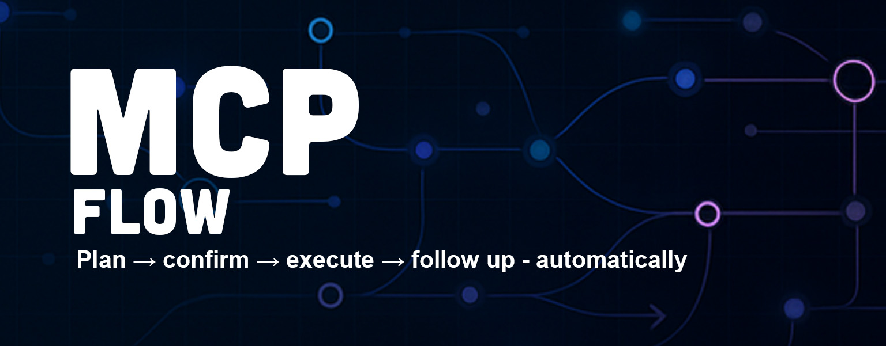

# MCPFlow

<div align="center">



**Orchestrate MCP tools into safe, guided workflows**

[](https://www.nuget.org/packages/MCPFlow)
[](LICENSE)
[](https://dotnet.microsoft.com/download/dotnet/8.0)

*A lightweight .NET library for returning **structured plans** from your MCP tools so agents like Cursor can: **plan → ask for approval → execute → follow up**.*

</div>

---

## 📋 Table of Contents

- [🚀 Quick Start](#-quick-start)
  - [Installation](#installation)
  - [TL;DR - What you return from your MCP tool](#tldr---what-you-return-from-your-mcp-tool)
- [📋 Success Example](#-success-example)
- [⚠️ Common Error Patterns](#️-common-error-patterns)
  - [1️⃣ Recoverable "ID not found"](#1️⃣-recoverable-id-not-found)
  - [2️⃣ Invalid input (schema/validation)](#2️⃣-invalid-input-schemavalidation)
  - [3️⃣ Blocked (external dependency/permission)](#3️⃣-blocked-external-dependencypermission)
  - [4️⃣ Partial progress](#4️⃣-partial-progress)
- [💬 Message Snippets](#-message-snippets)
- [📖 Field Glossary](#-field-glossary)
  - [Next Actions Fields](#next-actions-fields)
  - [Safety Fields](#safety-fields)
- [🛠️ Using the Builder & Serializer](#️-using-the-builder--serializer)
  - [Enum Strings (Recommended)](#enum-strings-recommended)
- [🎯 Why This Helps](#-why-this-helps)
- [🚀 Use with Cursor](#-use-with-cursor)
  - [1️⃣ Your MCP tool returns an MCPFlow plan](#1️⃣-your-mcp-tool-returns-an-mcpflow-plan)
  - [2️⃣ Minimal Cursor Rule](#2️⃣-minimal-cursor-rule)
  - [3️⃣ Optional: State machine](#3️⃣-optional-state-machine)
- [🤖 Use with GitHub Copilot Agent (generic)](#-use-with-github-copilot-agent-generic)
  - [1️⃣ Expose an HTTP action (or CLI) that returns MCPFlow](#1️⃣-expose-an-http-action-or-cli-that-returns-mcpflow)
  - [2️⃣ Agent/Extension instructions](#2️⃣-agentextension-instructions)
  - [3️⃣ Minimal success flow (Copilot chat)](#3️⃣-minimal-success-flow-copilot-chat)
- [🧪 Quick Smoke Test Plan](#-quick-smoke-test-plan)
- [📄 License](#-license)

---

## 🚀 Quick Start

### Installation

```bash
dotnet add package MCPFlow
```

### TL;DR - What you return from your MCP tool

```csharp
using MCPFlow;

var plan = FlowBuilder.Orchestrated(PlanStatus.Ok)
    .WithInstruction("Scaffold Payroll screen and components.")
    .WithFollowUp("Wire the new components to the API now?")
    .WithSafety(writesCode: true, touchesFiles: new[] { "src/modules/payroll/**" })
    .AddNextAction("create_screen", new {
        screen = "Payroll",
        components = new[] { "OvertimeStartDaySelector", "PayPeriodConfigurator", "PTCHoursOverride" }
    })
    .Build();

// Return a structured JSON object (nulls omitted):
return FlowResult.Payload(plan);
```

**Agent flow you'll typically pair with this:**

1. Show the **instruction** as a plan and ask "Proceed?"
2. On "Yes", run **next_actions** in order.
3. On success, ask **follow_up**.

---

## 📋 Success Example

Here's the JSON your tool returns:

```json
{
  "kind": "orchestrated_plan",
  "version": "1",
  "status": "ok",
  "instruction": "Scaffold Payroll screen and components.",
  "next_actions": [
    {
      "tool": "create_screen",
      "args": {
        "screen": "Payroll",
        "components": ["OvertimeStartDaySelector", "PayPeriodConfigurator", "PTCHoursOverride"]
      }
    }
  ],
  "follow_up": "Wire the new components to the API now?",
  "safety": { 
    "writes_code": true, 
    "touches_files": ["src/modules/payroll/**"] 
  }
}
```

---

## ⚠️ Common Error Patterns

### 1️⃣ Recoverable "ID not found"

```json
{
  "kind": "orchestrated_plan",
  "version": "1",
  "status": "error",
  "instruction": "Cannot proceed: componentId 'abc123' not found.",
  "errors": [
    { 
      "code": "NOT_FOUND", 
      "field": "componentId", 
      "message": "No match for 'abc123'", 
      "hint": "Select from detected components", 
      "recoverable": true 
    }
  ],
  "missing": ["componentId"],
  "ask": {
    "prompt": "Choose a valid component or create a placeholder.",
    "fields": [{ "name": "componentId", "type": "select", "required": true }]
  },
  "recovery_actions": [
    { "tool": "list_detected_components", "args": { "screen": "Payroll" } },
    { 
      "tool": "create_placeholder_component", 
      "args": { "name": "NewComponent" }, 
      "label": "Create placeholder (safe)", 
      "confirm": true 
    }
  ],
  "follow_up": "After fixing the component, wire API connections?"
}
```

### 2️⃣ Invalid input (schema/validation)

```json
{
  "kind": "orchestrated_plan",
  "version": "1",
  "status": "invalid",
  "instruction": "Input failed validation.",
  "errors": [
    { "code": "REQUIRED", "field": "screen", "message": "Missing 'screen'" },
    { "code": "TYPE", "field": "components", "message": "Expected array of strings" }
  ],
  "ask": {
    "prompt": "Provide the missing/invalid fields.",
    "fields": [
      { "name": "screen", "type": "string", "required": true },
      { "name": "components", "type": "string" }
    ]
  },
  "follow_up": "Proceed to scaffolding once valid?"
}
```

### 3️⃣ Blocked (external dependency/permission)

```json
{
  "kind": "orchestrated_plan",
  "version": "1",
  "status": "blocked",
  "instruction": "Blocked: target path is read-only.",
  "errors": [{ 
    "code": "PERMISSION", 
    "message": "Read-only file system", 
    "recoverable": false 
  }],
  "recovery_actions": [{ "tool": "select_output_directory", "args": {} }],
  "follow_up": "Retry scaffolding after selecting a writable path?"
}
```

### 4️⃣ Partial progress

```json
{
  "kind": "orchestrated_plan",
  "version": "1",
  "status": "partial",
  "instruction": "Scaffolded some components; a few failed.",
  "partial_results": [
    { "step": "create_screen", "outcome": "ok", "detail": "Base page created" },
    { "step": "create_component:PTCHoursOverride", "outcome": "failed", "detail": "Template missing" }
  ],
  "recovery_actions": [{ 
    "tool": "create_placeholder_component", 
    "args": { "name": "PTCHoursOverride" } 
  }],
  "follow_up": "Continue by wiring API for the completed components?"
}
```

---

## 💬 Message Snippets

Here's what your agent typically says:

### **Approval prompt:**
> *Plan:* Scaffold Payroll screen with 3 components.  
> *Changes:* `src/modules/payroll/**`  
> **Proceed?**

### **Done message:**
> *Done.* Created screen + components. **Wire the new components to the API now?**

### **Recoverable error:**
> Couldn't find `componentId="abc123"`. Select an existing component or create a placeholder.

---

## 📖 Field Glossary

Here's what each field means—super short:

| Field | Description |
|-------|-------------|
| **`kind`** | Payload type. `"orchestrated_plan"` tells the agent this is a plan to execute. |
| **`version`** | Schema version for this envelope. Use to evolve safely. |
| **`status`** | Plan state enum. `ok` = 0, `error` = 1, `invalid` = 2, `blocked` = 3, `partial` = 4. |
| **`instruction`** | Human-readable summary of what the plan intends to do (for the approval prompt). |
| **`next_actions`** | Ordered steps (tools) to run on user approval. |
| **`follow_up`** | Question to ask after all `next_actions` succeed (to continue the flow). |
| **`errors`** | Machine/human diagnostics when something went wrong. |
| **`warnings`** | Non-fatal issues worth showing (e.g., deprecations, guesses). |
| **`missing`** | Names of required inputs not provided (e.g., `"componentId"`). |
| **`partial_results`** | What already happened in this session (per step: ok/skipped/failed, with detail). |
| **`ask`** | A mini form spec to unblock (prompt + fields to collect) before re-planning or continuing. |
| **`recovery_actions`** | Safe alternatives to fix/retry (e.g., list components, create placeholder). |
| **`safety`** | Risk preview to show before execution. |
| **`affected_paths`** | Specific files/paths actually touched/created (fill after execution if you track them). |
| **`correlation_id`** | Trace/debug id to tie tool logs, chat steps, and telemetry together. |

### Next Actions Fields

| Field | Description |
|-------|-------------|
| **`tool`** | MCP tool name to invoke. |
| **`args`** | Arguments for that tool (free-form JSON object). |
| **`label`** | Optional UI label for the step (nice to have). |
| **`confirm`** | If true, force an extra "are you sure?" before this step. |

### Safety Fields

| Field | Description |
|-------|-------------|
| **`writes_code`** | Will this write/modify code? |
| **`touches_files`** | Glob(s)/paths likely to be changed (for approval UI). |

> **Note:** In your serializer, null fields are omitted, keeping responses clean.

---

## 🛠️ Using the Builder & Serializer

```csharp
// Build success
var ok = FlowBuilder.Orchestrated(PlanStatus.Ok)
    .WithInstruction("Scaffold Payroll screen and components.")
    .WithFollowUp("Wire the new components to the API now?")
    .AddNextAction("create_screen", new { 
        screen = "Payroll", 
        components = new[] { "OvertimeStartDaySelector", "PayPeriodConfigurator", "PTCHoursOverride" } 
    })
    .Build();

// Build recoverable error
var err = FlowBuilder.Orchestrated(PlanStatus.Error)
    .WithInstruction("Cannot proceed: componentId 'abc123' not found.")
    .NotFound("componentId", "abc123", "Select from detected components.")
    .AddMissing("componentId")
    .WithAsk("Choose a valid component or create a placeholder.",
             new[] { new AskField { Name = "componentId", Type = AskFieldType.Select, Required = true } })
    .AddRecoveryAction("list_detected_components", new { screen = "Payroll" })
    .AddRecoveryAction("create_placeholder_component", new { name = "NewComponent" }, 
                      label: "Create placeholder (safe)", confirm: true)
    .WithFollowUp("After fixing the component, wire API connections?")
    .Build();

// Return structured JSON (preferred for MCP tools)
return FlowResult.Payload(ok);  // or FlowResult.Payload(err);

// Or string form if you truly need it
var json = FlowResult.Json(ok, indented: true);
```

### Enum Strings (Recommended)

Add `JsonStringEnumConverter(JsonNamingPolicy.CamelCase)` to get `"ok"`, `"error"`, etc. Or use an `EnumMember` converter for custom literals.

---

## 🎯 Why This Helps

- ✅ **Predictable, testable plans** instead of ad-hoc strings
- ✅ **Enforces approval gates** and follow-ups
- ✅ **Clean JSON** with nulls omitted; easy to diff and log
- ✅ **Works great** with a simple Cursor rule or a `workflow_state.md` state machine

---

## 🚀 Use with Cursor

### 1️⃣ Your MCP tool returns an MCPFlow plan

```csharp
return FlowResult.Payload(
    FlowBuilder.Orchestrated(PlanStatus.Ok)
      .WithInstruction("Scaffold Payroll screen and components.")
      .WithFollowUp("Wire the new components to the API now?")
      .WithSafety(writesCode: true, touchesFiles: new[] { "src/modules/payroll/**" })
      .AddNextAction("create_screen", new {
          screen = "Payroll",
          components = new[] { "OvertimeStartDaySelector","PayPeriodConfigurator","PTCHoursOverride" }
      })
      .Build()
);
```

### 2️⃣ Minimal Cursor Rule (`.cursor/rules/mcpflow.md`)

```markdown
---
type: Always
description: "MCPFlow: plan → approval → execute → follow-up"
alwaysApply: true
---

If the last tool result contains `"kind":"orchestrated_plan"`:

1) Print a 1–3 line PLAN from `instruction`. Show `safety.writes_code` and `safety.touches_files`.
2) Ask: **Proceed?**
3) If **Yes**:
   - For each `next_actions` item:
     - Briefly say what will run; then call the tool with `args`.
   - When done, if `follow_up` exists, ask it.
4) If **No**: Ask what to change and request a new plan.
```

### 3️⃣ Optional: State machine (`workflow_state.md`)

```markdown
# Workflow State

## State
NEEDS_PLAN_APPROVAL

## Plan
(none)

## Rules
- If State=NEEDS_PLAN_APPROVAL and a plan appears:
  - Summarize `instruction`; ask "Proceed?"
  - On Yes → State=EXECUTING; copy `next_actions` into ## Plan
  - On No  → ask for changes; re-run planning tool
- If State=EXECUTING:
  - Run steps in ## Plan; if all succeed → FOLLOW_UP_PENDING; on error → BLOCKED
- If State=FOLLOW_UP_PENDING:
  - Ask `follow_up`; Yes → EXECUTING with a new Plan; No → IDLE

## Log
- Initialized
```

#### (Optional) Driver rule to enforce the loop (`.cursor/rules/state-driver.md`)

```markdown
---
type: Always
description: "Read→decide→act→update using workflow_state.md"
alwaysApply: true
---

Before any action:
- Read ./workflow_state.md (## State/Plan/Rules)
- Decide next step per ## Rules
- Act (ask user or call tool)
- Update ./workflow_state.md (## State/Plan/Log)
```

**That's it!** Cursor will now: show plan → get approval → run tools → ask follow-up.

---

## 🤖 Use with GitHub Copilot Agent (generic)

Copilot doesn't use Cursor rules, but you can achieve the same flow via your **agent/extension instructions** and a small action that calls your tool and returns MCPFlow JSON.

### 1️⃣ Expose an HTTP action (or CLI) that returns MCPFlow

*TypeScript example (Express), but your server can be C#; just return the JSON from `FlowResult.Payload(plan)`.*

```typescript
app.post("/mcpflow/create_screen", async (req, res) => {
  const plan = /* call your C# MCP tool or service → returns MCPFlow JSON */;
  res.json(plan);
});
```

### 2️⃣ Agent/Extension instructions (paste into your Copilot agent's system/instructions)

```
When an API response contains {"kind":"orchestrated_plan"}:
1. Summarize 'instruction' in ≤3 lines and ask the user "Proceed?"
2. If user approves:
   - For each item in 'next_actions', call its tool/endpoint with 'args'.
   - After all succeed, ask the 'follow_up' question if present.
3. On errors/invalid:
   - Display 'errors' and 'ask' fields; collect required inputs.
   - Optionally call 'recovery_actions' to unblock, then request a fresh plan.
Always show which files may change (safety.touches_files) before executing.
```

### 3️⃣ Minimal success flow (Copilot chat)

* **You:** "Create the Payroll screen from this screenshot."
* **Agent:** *Shows plan from `instruction` + safety.* "Proceed?"
* **You:** "Yes."
* **Agent:** *Runs each `next_actions` call, then* "Wire the new components to the API now?"

---

## 🧪 Quick Smoke Test Plan

Return this from your tool to verify the end-to-end loop:

```json
{
  "kind": "orchestrated_plan",
  "version": "1",
  "status": "ok",
  "instruction": "Create a Demo page and one component.",
  "next_actions": [
    { "tool": "create_screen", "args": { "screen": "Demo", "components": ["HelloBox"] } }
  ],
  "follow_up": "Add API wiring for HelloBox?",
  "safety": { "writes_code": true, "touches_files": ["src/modules/demo/**"] }
}
```

**If you see:** plan → approval → tool run → follow-up, you're good! 🎉
